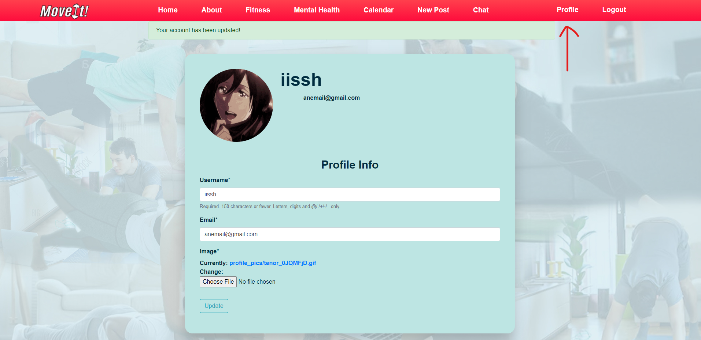
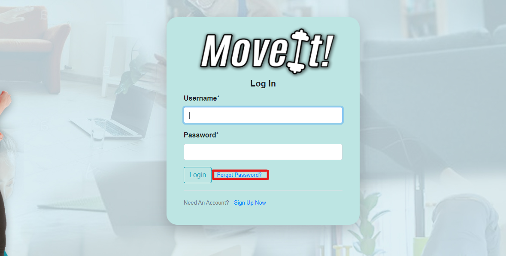
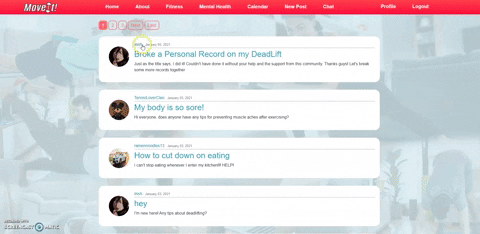

# Move It!
A hackathon project for BramptonHacks. Move It is a fitness and wellness social-networking platform that allows like-minded individuals 
This social-networking platform was created using Django for the backend and HTML and CSS for the frontend.

## How to Join the MoveIt Community:
  1. Visit http://iissh.pythonanywhere.com/.
  2. Register as a new user.
  3. Create Blog posts!

## Notable Features
#### Change profile picture, username and email.
     You can change your profile picture, username and email whenever you want! Just click the profile tab and enter the new ones.
              
### Password Reset 
     Forgot your password? That's okay, Click "Forgot Password?" under the Login section and enter your email. Then you can create a new password through there.
            
### View all posts by a User 
     Curious about the posts your peers have been posting? Just click their username to see everything they have posted.
              
### Highly User-friendly 
The website has no hidden tricks. It is super easy to navigate and has customizable features to always keep the experience fresh.

